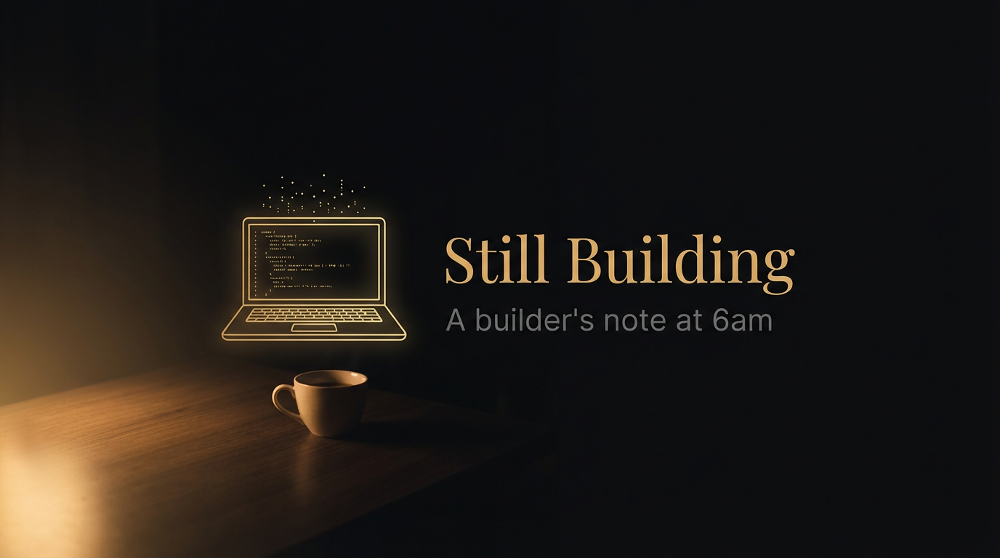
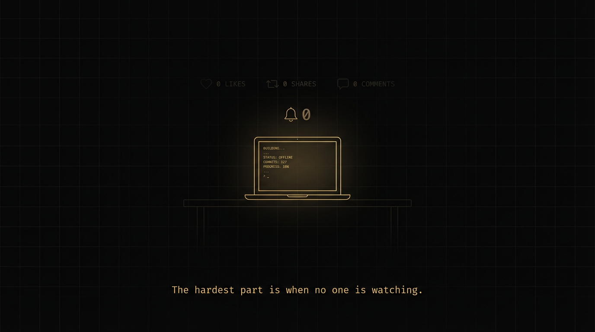
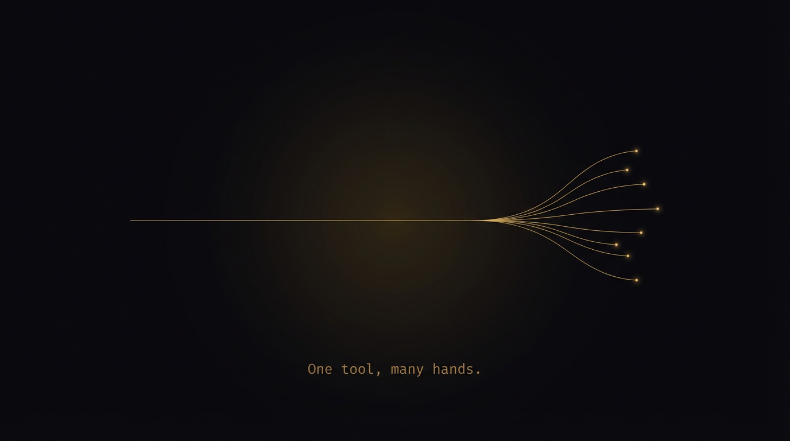
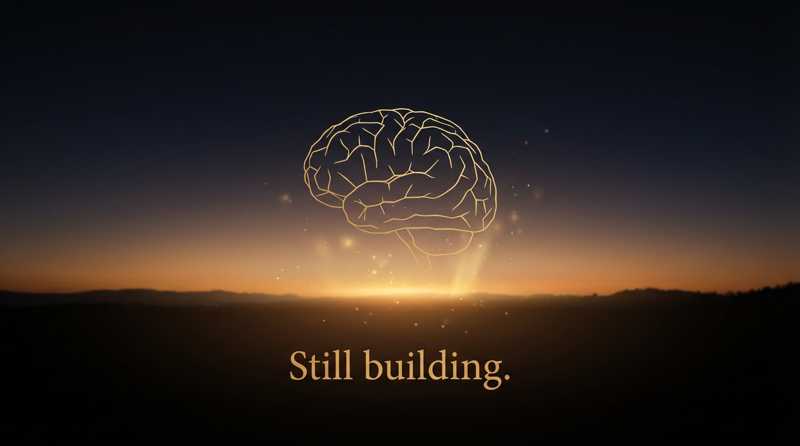

# Still Building — 一个 Builder 的凌晨笔记

---

凌晨六点，窗外还是黑的，屏幕上的代码亮着。

旁边的咖啡凉了。不记得是什么时候倒的。

这不是什么英雄主义叙事。没有"连续通宵七天做出了一个改变世界的产品"。只是一个普通的晚上，做着一个普通的项目，写到天快亮了。

---

## 开始做这个的原因很简单

我在 BSC 上写合约、做交易工具。每天的工作流程差不多：查价格、看涨幅排名、盯资金费率、写合约、跑测试、拼部署脚本。

这些事情每一件都不难。但每一件都需要从头来一遍。打开浏览器，找到 API 文档，写一段请求代码，解析返回值，格式化输出。

做了两年，我发现我花在"准备工作"上的时间，比花在"真正思考"上的时间还多。

后来用上了 AI Agent。它很聪明，什么都能学，但问题是——它什么都不"会"。你让它查个 BTC 价格，它得从零开始：找哪个 API 能用、怎么拼请求、返回值长什么样。下次你再问，它又忘了。

我就想，能不能把这些反复用到的东西打包好，装上就能用？

不是教程，不是文档，是一个标准化的、可安装的、AI Agent 拿到就能执行的技能模块。

这就是 SkillsHub 的起点。没有商业计划书，没有投资人，就是自己想用。

---

## 没人看的时候最难

做 side project 的人应该都知道这种感觉。

写了一天代码，发了个推，0 赞 0 转发 0 评论。

然后你问自己：有人需要这个吗？有人会用这个吗？我是不是在浪费时间？

这些问题没有答案。至少在你做的时候没有。

我见过太多好项目死在这个阶段——不是技术不行，不是方向不对，是做的人自己先放弃了。因为没有反馈，没有认可，没有任何迹象表明有人在乎。

唯一能对抗这种感觉的办法就是：别想，继续做。

先把第一个 Skill 做出来。然后第二个。然后第三个。

等到做到第十三个的时候回头看，发现这个东西已经有了自己的形状。行情数据、合约开发、基础设施检查——它不再是一堆零散的脚本，它是一个完整的技能库。

---

## 我想起了第一次用别人开源工具的感觉

那是几年前的事了。我在赶一个 deadline，有个需求要做数据格式转换。自己写的话可能要两天。

然后我在 GitHub 上找到了一个工具。Star 数不多，README 写得很简洁，但用起来刚好解决我的问题。两行命令，搞定了。

我省了两天的活。

写那个工具的人，大概率不知道我的存在。他可能也是某个深夜，在自己的电脑前，觉得这个东西别人可能用得上，就写了。

我到现在都不知道他是谁。但那两天是他帮我省下来的。

我想做同样的事。

写一个 Price Snapshot，也许某天凌晨三点有人想看一眼 BTC 价格，不用再自己拼 API 了。

写一个 Funding Watch，也许某个做合约的人终于不用每次手动查资金费率了。

写一个 BAP578 Adapter Blueprint，也许某个第一次接触这个标准的开发者不用再从一个空白文件开始了。

他们可能永远不会知道这些 Skill 是谁写的。

没关系。工具的价值不在于被感谢，在于被使用。

---

## 做到了什么

到今天为止，SkillsHub 上线了 13 个 Skill。

8 个行情数据类的——从价格快照到涨幅排名，从 K 线总结到资金费率，从持仓量追踪到 RPC 节点检测。覆盖了一个交易者和开发者日常最高频的数据需求。

5 个 BAP578 合约开发类的——合约蓝图、安全清单、部署计划、测试骨架、想法拆解。一个人从零开始写 BAP578 合约可能要一周，装上这些 Skill 一天能出原型。

有一个黑金风格的网站，有一个可以在浏览器里直接试用的 Playground，支持中英文，GitOps 自动部署。

今天又更新了一波：新 Logo 上线，独立的 Roadmap 页面上线，Top Movers 支持按成交额排序了，Funding Watch 加了年化资金费率和基差。

不算多。但都是实实在在跑着的东西。

---

## 接下来

Skill 会继续加。DeFi 风控模块、清算信号、蜜罐检测，这些都在计划里。

但更重要的是，我希望这个东西不是只有我一个人在做。

开源项目最好的状态不是一个人写了很多代码，是很多人都觉得"我也可以贡献一个 Skill"。

所以 SkillsHub 的格式是完全开放的。每个 Skill 就是一个 JSON 定义加一个 SKILL.md 文档。你有一个好用的工具、一个实用的查询、一个开发辅助脚本，都可以按这个格式包装成一个 Skill。

你需要什么 Skill，告诉我，我来做。
你有什么 Skill 想贡献，也告诉我，我来帮你合入主库。

---

## 最后

凌晨六点了。咖啡彻底凉了。

外面的天开始有点亮了。

再提交一个 commit。不睡了，白天还要继续运营。

天亮了，该发的推发出去，该回的评论回掉，该加的 Skill 继续加。

不是硬撑。是停不下来。

Still building.

---

## 配图清单

| 位置 | 文件 |
|------|------|
| Banner | assets/article-still-building-banner.png |
| "没人看的时候" | assets/article-no-one-watching.png |
| "一个工具，很多人" | assets/article-one-tool-many-hands.png |
| 结尾 "天亮了" | assets/article-still-building-dawn.png |
