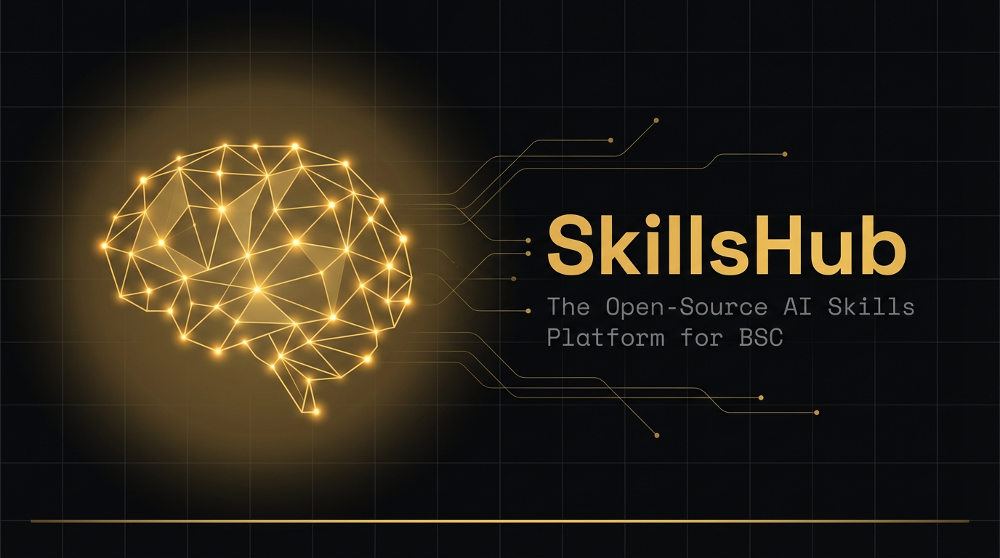
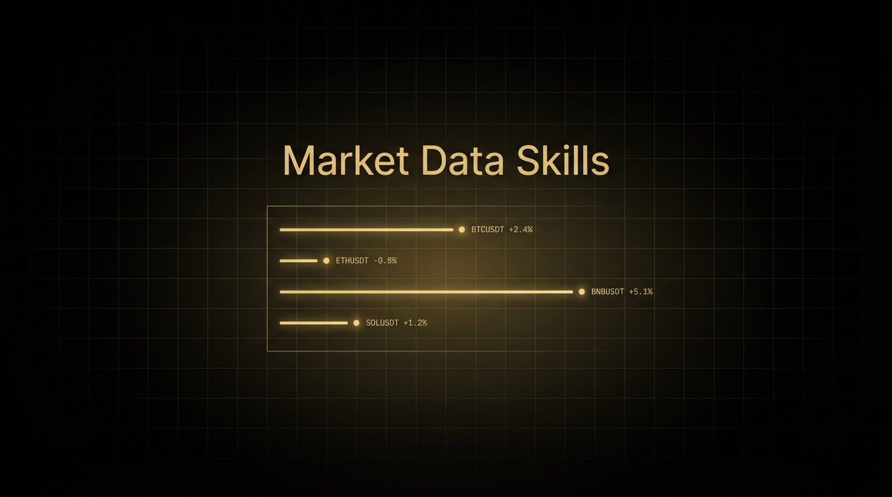
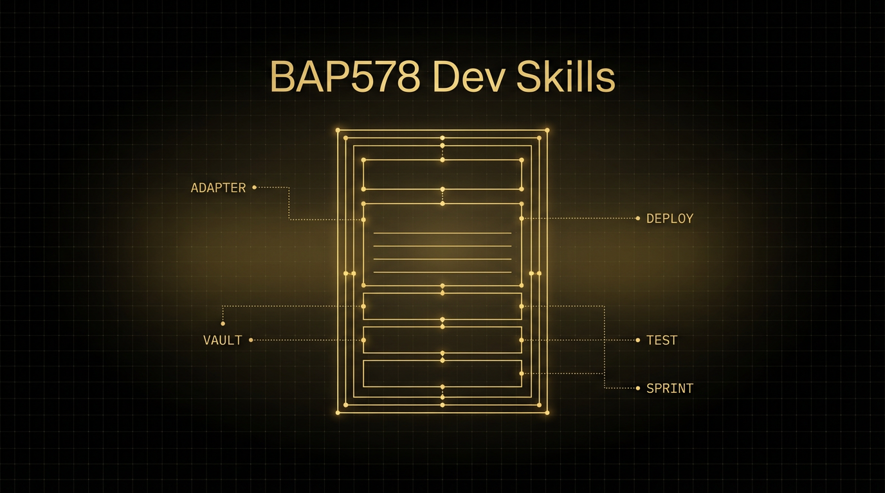
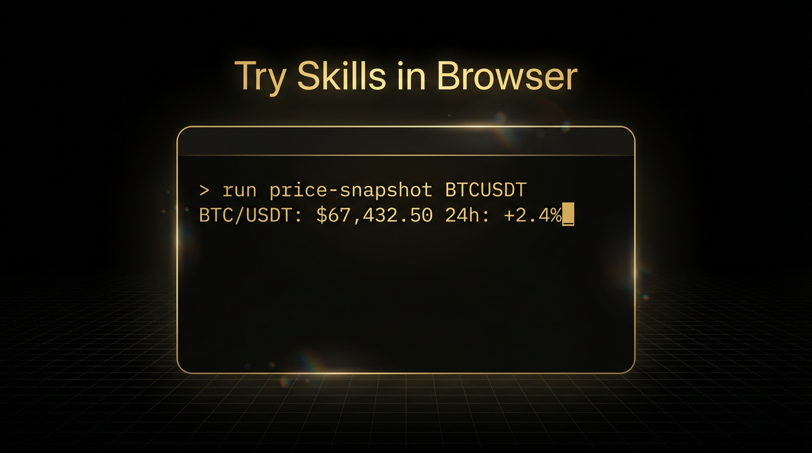
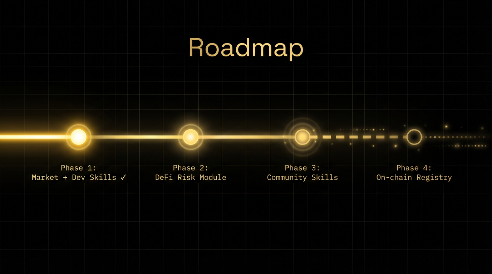

# SkillsHub：我给 BSC 上的 AI Agent 做了一个开源技能集合

> Twitter Article 全文 | 配图文件见文末清单

---



---

## 为什么要做这个

我是一个在 BSC 上写合约、做交易工具的开发者。

每天的工作大同小异：查价格、看 K 线、盯资金费率、写合约、跑测试、拼部署脚本。这些事情每一件都不难，但每一件都要从头来——打开网页、找接口、写代码、调格式。日复一日，消耗的不是脑力，是耐心。

后来 AI Agent 出来了，我开始用 Agent 帮我干活。但很快发现一个问题：Agent 很聪明，但它什么都不"会"。你要它查个 BTC 价格，它得从零开始找 API、写请求、解析返回值。每次都是一样的事情，每次都要重新教。

我就想：**能不能把这些反复用到的能力打包成一个个"技能"，装上就能用？**

这就是 SkillsHub 的起点。

---

## 什么是 Skill

Skill 是一个结构化的能力模块。每个 Skill 有明确的输入、输出、分类和安装命令。

不是一段随便写的脚本，也不是一个教程文档。它是一个标准化的、可以被 AI Agent 直接理解和执行的技能单元。

举个例子：

```
npx @skillshub/price-snapshot
```

这一条命令装上之后，你的 Agent 就具备了"查询任意交易对实时价格和 24h 涨跌"的能力。不需要你再教它怎么调 API、怎么解析 JSON。

**Skill 的意义不是替你写代码，是帮你省掉那些重复的、消耗精力的环节。**

---

## 行情数据类 Skills



目前上线了 8 个行情数据类 Skill，直接对接币安的 API，覆盖了日常最高频的数据查询场景：

**Price Snapshot** — 查询任意交易对的实时现货价格和 24h 涨跌幅。最简单也最常用的 Skill。凌晨三点想看一眼 BTC 多少钱？一条命令搞定。

**Top Movers Radar** — 全市场涨幅排名，支持按报价资产筛选，还能设置最低成交量门槛过滤掉那些"假涨"的小币。我自己每天开盘第一件事就是跑这个。

**Kline Brief** — 把最近几十根 K 线浓缩成一段趋势总结。短期涨了多少、波动多大，一目了然。适合那些没时间盯盘但需要快速决策的场景。

**Symbol Status** — 检查一个交易对的交易状态、基础资产、报价资产、所有核心过滤器。有些币看着有价格但其实已经暂停交易了，这个 Skill 帮你避坑。

**Funding Watch** — 读取币安合约的实时资金费率、标记价格、下次结算时间。做合约的人都知道，费率是市场情绪最诚实的温度计。

**Open Interest Scan** — 追踪合约持仓量快照。价格涨了，持仓量也在涨说明有真金白银在进场；持仓量在跌说明是存量博弈。跟着数据走，不跟着 KOL 走。

**BSC RPC Fanout Check** — 同时验证多个 BSC RPC 端点的一致性。哪个节点掉了、哪个在延迟，一目了然。做链上开发的基础设施保障。

**AI Quick Chat** — 发一句 prompt 给 AI，验证整个 AI 链路是否连通。看起来最简单，但每次配环境、换模型的时候第一步永远是"这东西通了没"。地基不稳，大楼白盖。

---

## BAP578 智能合约开发类 Skills



BSC 上有一个叫 BAP578 的标准，核心概念是 token-bound agent accounts——让 NFT 绑定智能合约账户。这是 BSC 上 AI Agent 和链上资产交互的重要基础。

但实际开发的时候，从合约编写到测试到部署，每一步都有大量重复工作。所以我做了一整套 BAP578 开发辅助 Skills，总共 5 个：

**Adapter Blueprint** — 输入合约名和接口名，直接生成一个带 vault 资金控制的 adapter 合约蓝图。不用从空白文件开始写。

**Vault Checklist** — 输出一份完整的安全清单，覆盖 tokenId 所有权验证、vault 控制器权限设计。部署前跑一遍这个清单，心里踏实。

**Deploy Plan** — 自动构建 BSC 主网部署的顺序清单和命令模板。合约多了之后部署顺序容易搞混，这个帮你理清楚。

**Test Template** — 生成 Hardhat 测试骨架，覆盖权限验证和余额一致性测试。不用每次从 describe-it-expect 的空壳开始写。

**Contract Idea Sprint** — 你有一个游戏或 Agent 相关的想法？输入一句话描述，它帮你拆解成一个一天能落地的合约实现计划。从想法到原型的最短路径。

一个人从零开始写 BAP578 合约可能要一周。装上这五个 Skill，一天就能出原型。

---

## 在浏览器里试用



SkillsHub 不只是一个列表页面。我们内置了一个 Playground，你可以在浏览器里直接选择任意 Skill、输入参数、点击运行，实时看到结果。

不需要安装任何东西，不需要命令行，打开网页就能试。

想看 BTC 现在多少钱？在 Playground 里选 Price Snapshot，输入 BTCUSDT，点运行，两秒钟返回结果。

想看今天涨最多的是哪些币？选 Top Movers Radar，设一个 5000 万的成交量门槛，跑一下就知道了。

Playground 的目的是降低门槛。你不需要是开发者也能用 Skills。

---

## 技术实现

说几个值得提的技术细节：

**本地优先架构** — 所有 Skill 的元信息存储在本地的 library.json 文件中，按技能库分组。后端 API 动态聚合所有 lib-*/library.json，不依赖外部数据库。

**标准化格式** — 每个 Skill 都有统一的结构：id、name、description、category、version、mode（live/guide）、inputExample、installCommand。这意味着任何人都可以按照同样的格式贡献新的 Skill。

**双模式** — Skill 分 live 和 guide 两种模式。live 模式直接调用真实 API 返回数据；guide 模式提供结构化的开发指南和模板。两种模式覆盖不同的使用场景。

**中英文双语** — 整站支持中英文切换。轻量级自研 i18n，无第三方依赖，React Context + localStorage 持久化，自动检测浏览器语言偏好。

**GitOps 部署** — 本地改完代码推到 Git，服务端自动拉取部署。没有手动 SSH 上服务器的操作。

---

## 路线图



**Phase 1（已完成）：Market + Dev Skills**
8 个行情数据 Skill + 5 个 BAP578 开发 Skill，网站上线，Playground 可用。

**Phase 2：DeFi 风控模块**
Token 风险评估、蜜罐检测、清算信号监控。这些是路线图里已经规划好的方向，代码库里的 ecosystem-intake 已经预留了接口。

**Phase 3：社区 Skills**
开放社区提交通道，任何人都可以按照标准格式贡献自己的 Skill。我们审核后合入主库。

**Phase 4：链上 Skill 注册表**
把 Skill 的元信息注册到 BSC 链上，实现去中心化的技能发现和验证。这是长期目标。

---

## 为什么是 BSC

BSC 最近在大力推进 Skills 叙事，这不是偶然。

一条链的价值不只在于 TVL 和交易量，更在于它的工具生态有多丰富。以太坊之所以强，不是因为 ETH 价格高，而是因为围绕它有无数的开发工具、框架、库。

BSC 需要同样的东西。不是更多的 DeFi fork，而是更多让开发者和用户真正"用起来"的工具。

SkillsHub 就是这个方向上的一个实践：把 AI Agent 需要的能力标准化、模块化、可安装化。让 BSC 生态里的每个人，不管是开发者还是交易者，都能用上 Skills。

---

## 最后的话


做 SkillsHub 的初衷很简单：我自己需要这些东西，做出来之后发现别人也需要。

13 个 Skill 只是开始。后面会有更多——但我不想自己闭门造车。

**你需要什么 Skill？**

想要一个查 Gas 的？想要一个监控巨鲸钱包的？想要一个自动分析合约安全的？

告诉我。我来做。

**Community Asks, Community Gets.**

社区想要，社区得到。

---

## 配图文件清单

| 位置 | 配图文件 |
|------|----------|
| Banner | assets/article-banner.png |
| 行情数据类 Skills | assets/article-market-skills.png |
| BAP578 开发类 Skills | assets/article-bap578-skills.png |
| Playground | assets/article-playground.png |
| 路线图 | assets/article-roadmap.png |
| 结尾 CTA | assets/article-community-cta.png |
