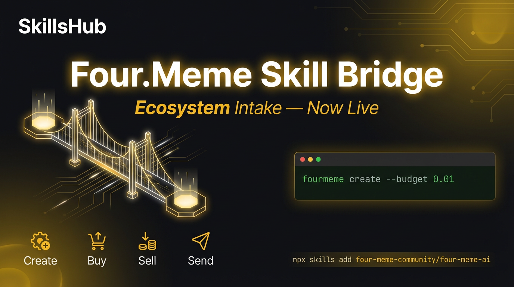

# Four.Meme Skill Bridge — 新账号推文 & Bio

> 本文件用于 Four.Meme Skill Bridge 专属推特账号的运营内容。
> 与 SkillsHub 主账号（twitter-threads.md）独立管理。

---

## X 账号 Bio

BSC 上第一个 Meme Agent 技能桥。AI Agent 说一句话就能发币、买卖、转账。Powered by @four_meme_official + SkillsHub。 #BNBChain #Meme

---

## 推文 1 — Four.Meme Skill Bridge 上线 【配图：tw-four-meme-bridge.png】

新 Skill 上线：Four.Meme Skill Bridge

SkillsHub 第三个技能库正式开门——Ecosystem Intake。

第一个装进来的，是 @four_meme_official 的官方 CLI。

你的 AI Agent 装上这个 Skill 之后，在对话里说一句话就能操作 Four.Meme：

"创建一个 meme 币，0.01 BNB 起步。" → fourmeme create --budget 0.01
"买入 0.5 BNB 的 MemeToken。" → fourmeme buy --amount 0.5
"卖掉 20% 持仓。" → fourmeme sell --percent 20
"转 30 万枚代币到这个地址。" → fourmeme send --to 0xabc...

不是从零开始造轮子。是把成熟的 CLI 桥接进来，Agent 直接调用，零胶水代码。

安装两步走：
1. pnpm add -g @four-meme/four-meme-ai@latest
2. npx skills add four-meme-community/four-meme-ai

配好 BSC RPC 和私钥，Agent 立刻能发币、买卖、转账。

这就是 Ecosystem Intake 的意义——不是什么都自己做，而是把生态里已经跑通的工具，标准化地接进 SkillsHub，让每个 Agent 都能用。

Four.Meme 是第一个。不会是最后一个。

npx skills add four-meme-community/four-meme-ai

#BNBChain #AI #Meme #SkillsHub

---

## 推文 2 — @four_meme_official 关注了我们，几小时新增 4 个 Skill 【配图：tw-four-meme-4new.png】

几个小时前，@four_meme_official 关注了我们。

没发感谢推，没截图庆祝。我们做了一件更实际的事——

拉上团队，在原有的 Four.Meme Skill Bridge 基础上，一口气新增了 4 个深度 Skill：

Create Pipeline — 两步发币流程，create-api 先预览、create-chain 再上链，每一步都有确认门控，不会手滑发错币。

Trade Playbook — 买卖之前先报价。滑点超标？自动拦截。亏损超限？直接拒绝。先 quote 再 execute，不给冲动交易留机会。

Agentic Ops — 给你的 Agent 装上策略脑：自动发现候选币、评分、分批建仓、事后复盘。全程 human-in-the-loop，每笔写操作都要你点头。

One-Stop Launch — 从发币到买入、从 ERC-8004 身份注册到推文素材生成，一条龙走完。适合想快速上线一个 meme 项目的人。

加上之前已有的 Four.Meme Skill Bridge（基础 CLI 桥接），SkillsHub 现在有 5 个 Four.Meme 相关 Skill，覆盖从入门到全自动的完整链路。

别人被关注发截图。我们被关注发版本。

#BNBChain #FourMeme #AI #Meme #SkillsHub

---

## 配图文件清单

| 推文 | 配图文件 |
|------|----------|
| 推文 1 Four.Meme Skill Bridge | assets/tw-four-meme-bridge.png |
| 推文 2 被关注后新增 4 个 Skill | assets/tw-four-meme-4new.png |
