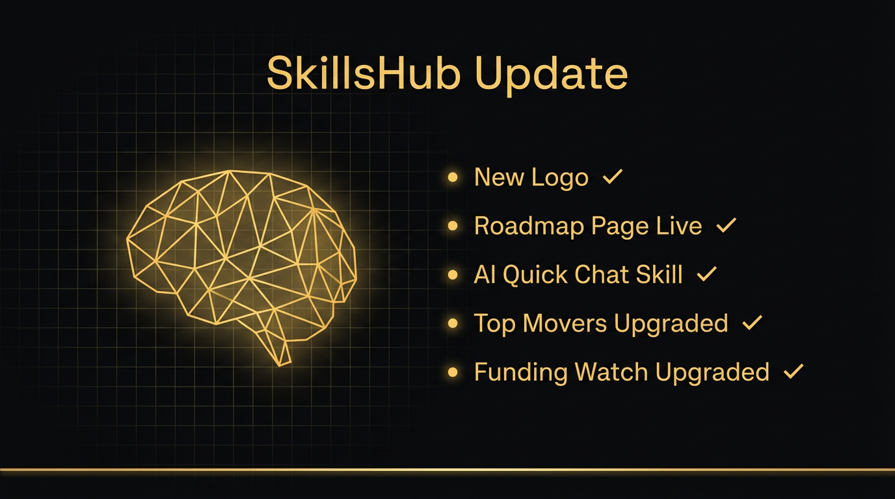
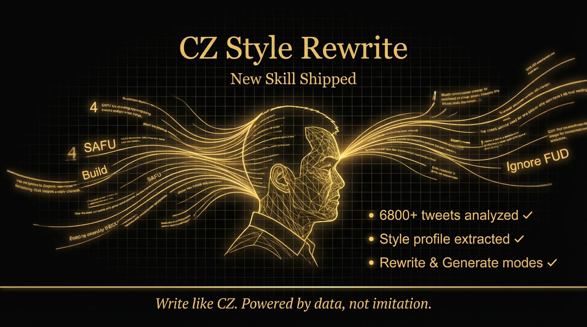
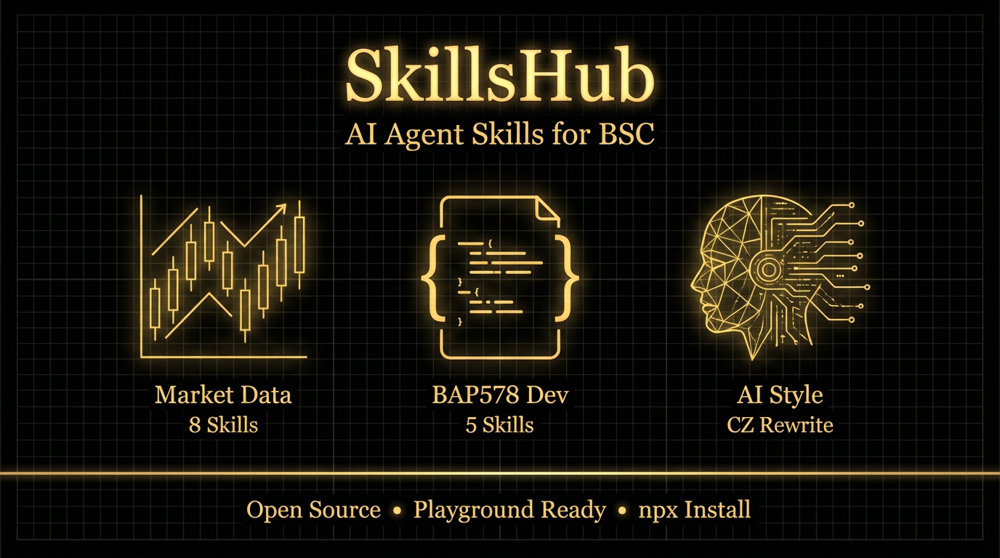
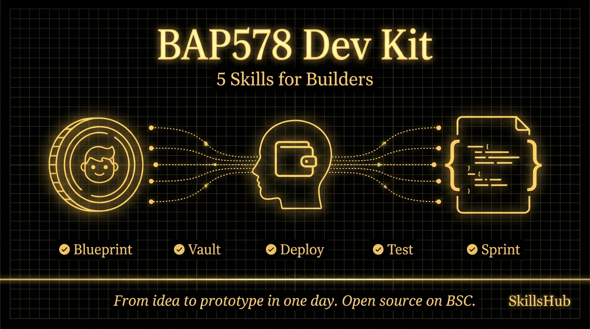

# SkillsHub 推特发帖素材

建议发布方式：每条间隔 1-2 小时，保持活跃度。也可以做成 thread 连发。

---

## 推文 1 — Price Snapshot

你有没有过这种时刻——凌晨三点，突然想看一眼 BTC 现在什么价。

不想打开交易所，不想看那些花里胡哨的 K 线图，就想要一个数字。

所以我做了 Price Snapshot。一条命令，实时现货价格 + 24h 涨跌，干干净净返回给你。

给 AI Agent 装上这个 Skill，它随时能帮你看一眼盘面。

npx @skillshub/price-snapshot

---

## 推文 2 — Top Movers Radar

每天几千个交易对，谁在涨？涨多少？有没有量？

自己翻太慢了。

Top Movers Radar 帮你按涨幅排名，还能过滤掉那些日成交量不到 5000 万的"假涨"。筛出来的都是真有资金在动的。

这个 Skill 我自己每天都在用。现在也给你。

npx @skillshub/top-movers-radar

---

## 推文 3 — Funding Watch 【配图：tw-funding-watch.png】

做合约的人都知道，资金费率是情绪的温度计。

费率飙高，说明多头太拥挤；费率转负，空头在压价。这个信号比任何 KOL 喊单都诚实。

Funding Watch 直接读币安合约的实时资金费率、标记价格、下次结算时间，一步到位。

别等爆仓了才想起来看费率。

npx @skillshub/funding-watch

---

## 推文 4 — Kline Brief

K 线看多了眼花，看少了没感觉。

Kline Brief 不是给你画图的，它是帮你"读图"的——把最近几十根 K 线浓缩成一段话：短期趋势多少、波动幅度怎样。

特别适合那些没时间盯盘，但需要快速判断该不该操作的时刻。

让你的 AI Agent 帮你读 K 线，比你自己盯盘靠谱。

npx @skillshub/kline-brief

---

## 推文 5 — BSC RPC Fanout Check

在 BSC 上做开发最怕什么？RPC 挂了你不知道。

交易发出去了，节点没响应，链上状态不一致，资金卡在半路。

BSC RPC Fanout Check 同时验证多个 RPC 端点的一致性，哪个节点掉了、哪个在延迟，一目了然。

做链上项目的人都该有这个。基础设施不牢，什么都白搭。

npx @skillshub/bsc-rpc-fanout-check

---

## 推文 6 — BAP578 系列

BSC 上有一个标准叫 BAP578，做的是 token-bound agent accounts——让 NFT 绑定智能合约账户。

听起来很酷，但实际上手开发的时候，合约怎么写、权限怎么设、怎么测试、怎么部署，全得自己摸索。

所以我做了一整套 BAP578 开发辅助 Skills：

Adapter Blueprint — 输入合约名和接口，直接生成带 vault 资金控制的 adapter 合约蓝图
Vault Checklist — tokenId 权限验证 + vault 控制器安全清单，部署前过一遍心里踏实
Deploy Plan — BSC 主网部署顺序 + 命令模板，不用自己拼脚本
Test Template — Hardhat 测试骨架，覆盖权限和余额一致性
Contract Idea Sprint — 你说一个想法，它帮你拆成一天能落地的合约实现计划

一个人从零开始写 BAP578 合约可能要一周。装上这五个 Skill，一天就能出原型。

这就是 Skills 的意义——不是替你写代码，是帮你省掉那些重复的、消耗精力的环节，让你专注在真正有创造力的部分。

---

## 推文 7 — Symbol Status

你准备交易一个币，但你知道它现在的交易状态吗？

有的币看着有价格，其实已经暂停交易了。有的币有最小下单量限制，挂单挂不上去。还有的币报价资产换了，你还在用旧的 pair。

Symbol Status 一条命令查清楚：交易状态、基础资产、报价资产、所有核心过滤器。

别在不能交易的币上浪费时间。

npx @skillshub/symbol-status

---

## 推文 8 — Open Interest Scan 【配图：tw-open-interest.png】

持仓量是市场里最容易被忽略的指标。

价格在涨，持仓量也在涨——说明有新资金在进场，趋势可能还没结束。
价格在涨，持仓量在跌——说明是存量博弈，随时可能反转。

Open Interest Scan 直接追踪合约持仓量快照，帮你判断当前的涨跌到底有没有"真金白银"在支撑。

少听 KOL 喊单，多看链上数据。

npx @skillshub/open-interest-scan

---

## 推文 9 — AI Quick Chat

这是最简单的一个 Skill，但可能也是最重要的。

AI Quick Chat 做一件事：发一句 prompt 给 AI，看它是不是通了。

听起来没什么用？但每次你搭环境、配 API Key、换模型的时候，第一步永远是——"这东西通了没？"

一条命令，AI 回你一句话，就知道整个链路是通的。

别小看基础设施。大楼再高，地基要稳。

npx @skillshub/ai-quick-chat

---

## 推文 10 — 收尾 【配图：tw-community-finale.png】

13 个 Skill，两个技能库，全部开源。

有人问我为什么要做这些。

因为我自己就是用户。每天盯盘、写合约、查数据、配环境，这些事情重复了无数遍。每次都从头来一遍，浪费的不是时间，是热情。

Skills 的意义不是炫技。是让你把精力留给真正重要的事。

SkillsHub 才刚开始。后面会有更多 Skill——DeFi 风控、清算信号、蜜罐检测、链上注册表。

你需要什么 Skill，评论区告诉我。

社区想要，社区得到。

Community Asks, Community Gets.

---

## 配图文件清单

| 推文 | 配图文件 |
|------|----------|
| 推文 3 Funding Watch | assets/tw-funding-watch.png |
| 推文 8 Open Interest Scan | assets/tw-open-interest.png |
| 推文 10 收尾煽情 | assets/tw-community-finale.png |
| CZ Style Rewrite | assets/tw-cz-style-rewrite.png |
| Four.Meme Skill Bridge | assets/tw-four-meme-bridge.png |
| 置顶推文 项目总体介绍 | assets/tw-skillshub-pinned.png |

其余推文为纯文字，不需要配图。

---
---

# 更新推文（2026-03-04）

---

## 推文 — 进展更新 【配图：tw-update-shipping.png】

说到做到，持续在发货。

今天更新了一波：

品牌升级 — 新 Logo 上线，SkillsHub 有了自己的脸。

Roadmap 页面 — 独立的路线图页面上线了，四个阶段的目标、交付物、KPI 全部公开透明。不画饼，按阶段交付。

新 Skill：AI Quick Chat — 一条命令验证 AI 链路是否连通。配环境、换模型的时候第一步永远是"通了没"，这个帮你秒级确认。

Skill 迭代升级：
- Top Movers 新增按成交额排序，不只看涨幅，还能看资金量
- Funding Watch 新增年化资金费率和基差指标，衍生品玩家的必看数据

官网也加上了项目 CA 和官方 X 链接，方便大家找到我们。

全部变更已通过 GitOps 部署到线上。

小步快跑，持续交付。这就是 SkillsHub 的节奏。

---

## 推文 — CZ Style Rewrite 【配图：tw-cz-style-rewrite.png】

新 Skill 上线：CZ Style Rewrite

我们从 CZ 6800+ 条公开推文中提取了一份风格画像——用词频率、句式结构、语气特征，全部数据化。

你的 AI Agent 装上这个 Skill 之后，可以用 CZ 的说话风格改写或生成内容。两种模式：

rewrite — 给一段草稿，它帮你改成 CZ 的语气
generate — 给一个话题，它直接用 CZ 风格写一条出来

不是模仿，不是冒充。是从数据中提炼出来的风格指纹，用于内容创作参考。

Write like CZ. Powered by data, not imitation.

npx @skillshub/cz-style-rewrite

---
---

# 置顶推文 — 项目总体介绍

---

## 置顶推文 【配图：tw-skillshub-pinned.png】

SkillsHub — BSC 上 AI Agent 的开源技能库。

AI Agent 很聪明，但它什么都不"会"。你让它查个 BTC 价格，它得从零开始找 API、写请求、解析返回值。下次再问，又忘了。

SkillsHub 把这些反复用到的能力打包成标准化的 Skill 模块。一条 npx 命令装上，Agent 直接能用。

目前上线 14 个 Skill，三个方向：

行情数据 — 价格快照、涨幅排名、K 线总结、资金费率、持仓量追踪、交易对状态检查、BSC RPC 节点检测、AI 链路验证。覆盖交易者和开发者日常最高频的数据需求。

BAP578 合约开发 — 合约蓝图生成、Vault 安全清单、部署计划、测试模板、想法拆解。一个人从零写 BAP578 合约要一周，装上这套 Skill 一天出原型。

AI 风格 — CZ Style Rewrite，基于 CZ 6800+ 条推文提取风格画像，让 Agent 用 CZ 的语气改写或生成内容。Powered by data, not imitation.

全部开源。浏览器 Playground 打开即用，不需要装任何东西。

GitHub: https://github.com/brief-onchain/skills-lab

你需要什么 Skill？告诉我，我来做。
Community Asks, Community Gets.

---
---

# X 账号 Bio

> 两条 Bio 并行使用，不互相替换。

---

## Bio 1（原有，research agent 定位）

AI-native onchain research agent for BNB Chain. One input, one brief -- plain-language risk summaries with evidence links. #VibingOnBNB

---

---
---

# BAP578 生态联动推文（@ladyxtel）

---

## 推文 — BAP578 Dev Kit for Builders 【配图：tw-bap578-builders.png】

.@ladyxtel BAP578 是我在 BSC 上见过最有想象力的标准之一——token-bound agent accounts，让 NFT 不再只是一张图，而是一个有链上账户、能持有资产、能执行操作的 Agent 身份。

但说实话，第一次上手开发的时候，我走了不少弯路。合约结构怎么设计、vault 权限怎么做、部署顺序怎么排，全靠自己一点点摸。

所以我做了一套 BAP578 开发辅助工具，打包成 5 个 AI Agent Skill，放在 SkillsHub 里开源了：

Adapter Blueprint — 输入合约名，直接生成带 vault 控制的 adapter 蓝图
Vault Checklist — tokenId 权限 + vault 安全清单，部署前过一遍
Deploy Plan — BSC 主网部署顺序 + 命令模板
Test Template — Hardhat 测试骨架，权限和余额一致性
Contract Idea Sprint — 一句话想法拆成一天能落地的实现计划

目标很简单：让下一个想在 BAP578 上做东西的开发者，不用再从零开始。

从想法到原型，一天。

GitHub: https://github.com/brief-onchain/skills-lab

---

## Bio 2（新增，SkillsHub 定位）

SkillsHub — BSC 上 AI Agent 的开源技能库。14 个 Skill 已上线：行情数据、BAP578 合约开发、CZ 风格改写。一条命令装上就能用。 #BNBAgents

---

> Four.Meme Skill Bridge 推文已移至独立文件：`docs/twitter-four-meme.md`（新账号运营）
